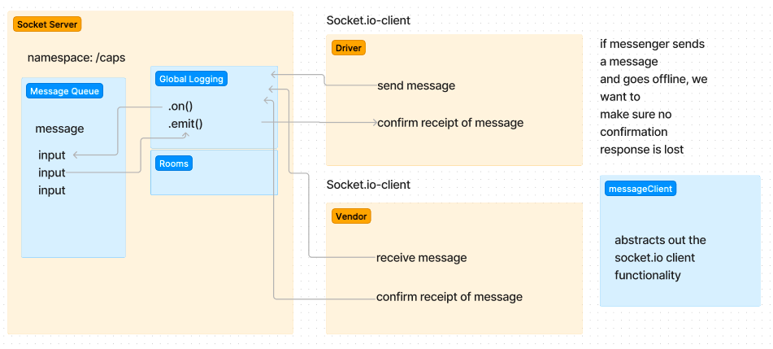

# CAPS-system

## Author: Camilla Rees
## Version: 1.0.0

## Deployment and Documentation
[Deployed Server on Render](https://caps-system.onrender.com/)

## Overview
CAPS - The Code Academy Parcel Service, a system that emulates a real world supply chain. CAPS will simulate a delivery service where vendors (such a flower shops) will ship products using our delivery service and when our drivers deliver them, each vendor will be notified that their customers received what they purchased.

Additionally, this app simulates a delivery driver receiving a list of orders from a Queue and “scanning” package codes on delivery. Retailers will be able to see in their dashboard or log, a list of all packages delivered in real time. Should a delivery driver deliver many packages while the retailer is not connected to the dashboard, the vendor client should be guaranteed to receive “delivery” notifications from the Queue system.

## How it Works / Key Features

- A Global Event Pool Module is implemented that exports a single EventEmitter from the Node JS module

- A Module for Managing Global Package Events is implemented that listens to ALL events in the Event Pool and logs a timestamp and the payload of every event

- A Module for Managing Vendor Events is implemented that, when triggered, simulates a pickup event for the given store name to the Global Event Pool and emits pickup to the global event pool and sends a vendor order payload

- A Module for Managing Driver Events is implemented that istens for a pickup event from the Global Event Pool and responds by logging a message to the console,
emitting an in-transit event to the Global Event Pool with the order payload, logging a confirmation message to the console, and emitting a delivered event to the Global Event Pool with the order payload

- A Module that guarantees that payloads from events are delivered to any Client Module that is listening for specific events. This Modules facilitates storing of payloads Server side and removing them when received by clients.

- A feature that keeps a log of payloads that reach our system, organized by vendor and event type. Payloads are “published” to the appropriate Clients for the appropriate events.

- Client Vendor Applications used by retailers, subscribe to appropriate Vendor Queues so that they can be alerted when a delivery was made.

- The Client can ask for all undelivered messages from a particalur Server Queue.
When a Client receives a message, it will need to let the hub server know that it was received.

## Architecture
Express
Socket

## Change Log
- [PR 1](https://github.com/camillarees/CAPS-system/pull/1)
- [PR 2](https://github.com/camillarees/CAPS-system/pull/3)
- [PR 3](https://github.com/camillarees/CAPS-system/pull/9)
- [PR 4](https://github.com/camillarees/CAPS-system/pull/11)

## Credit and Collaborations
- [401n49 MessageClient Demo Code](https://github.com/codefellows/seattle-code-javascript-401d49/tree/main/class-13/demo-with-message-client)
- [401n49 Socket Demo Code](https://github.com/codefellows/seattle-code-javascript-401d49/tree/main/class-12/live-demo/code-review)
- Worked with [Elias Staehle](https://github.com/EDStaehle), [Kenny Lino](https://github.com/kennywlino), and [Seth Pierce](https://github.com/sethppierce)