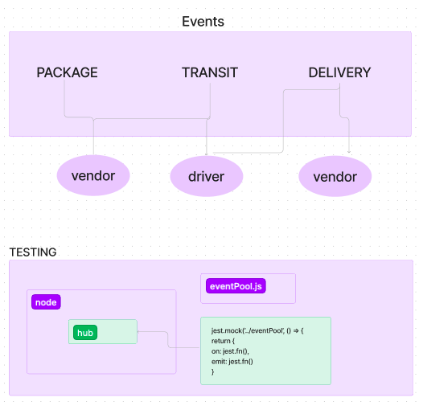

# CAPS-system

## Author: Camilla Rees
## Version: 1.0.0

## Deployment and Documentation
[Deployed Server on Render]()

## Overview
CAPS - The Code Academy Parcel Service, a system that emulates a real world supply chain. CAPS will simulate a delivery service where vendors (such a flower shops) will ship products using our delivery service and when our drivers deliver them, each vendor will be notified that their customers received what they purchased.

## How it Works / Key Features

- A Global Event Pool Module is implemented that exports a single EventEmitter from the Node JS module

- A Module for Managing Global Package Events is implemented that listens to ALL events in the Event Pool and logs a timestamp and the payload of every event

- A Module for Managing Vendor Events is implemented that, when triggered, simulates a pickup event for the given store name to the Global Event Pool and emits pickup to the global event pool and sends a vendor order payload

- A Module for Managing Driver Events is implemented that istens for a pickup event from the Global Event Pool and responds by logging a message to the console,
emitting an in-transit event to the Global Event Pool with the order payload, logging a confirmation message to the console, and emitting a delivered event to the Global Event Pool with the order payload

## Architecture
Express
Sequelize

## Change Log
- [PR 1](https://github.com/camillarees/CAPS-system/pull/1)
- [PR 2](https://github.com/camillarees/CAPS-system/pull/3)

## Credit and Collaborations
- [401n49 Demo Code]()
- Worked with [Elias Staehle](https://github.com/EDStaehle), [Kenny Lino](https://github.com/kennywlino), and [Seth Pierce](https://github.com/sethppierce)